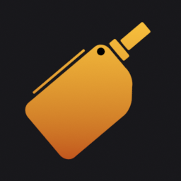
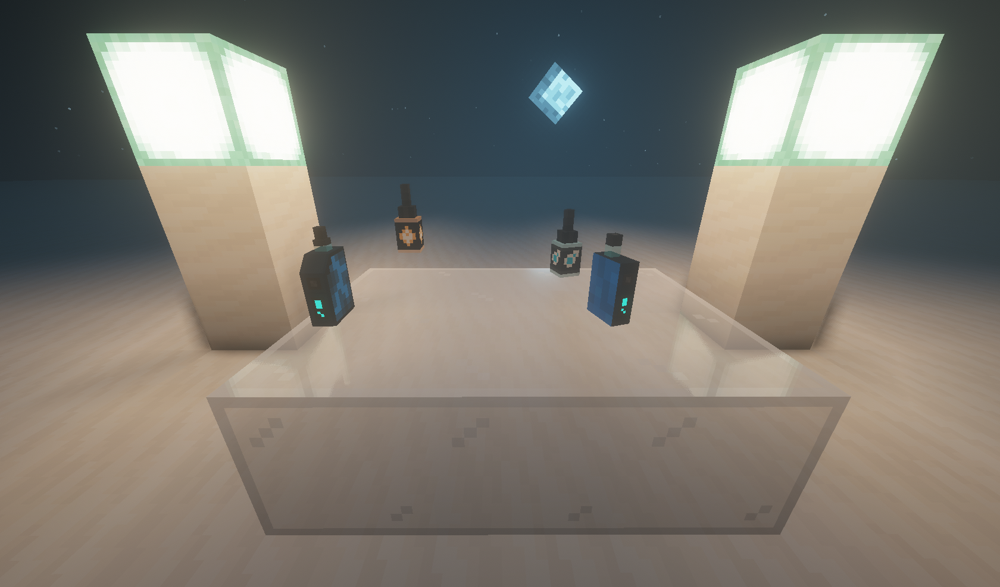

#  OUTBREAK Vapes Resourcepack

---

Ресурспак добавляет модели вэйпов и аксессуаров для них, используемые плагином на сервере OUTBREAK (работает по CustomModelData).

## [Скачивать в релизах](https://github.com/outbreak-team/vapes-resourcepack/releases/latest)

 CustomModelData | Предметы | Модель
-|-|-
`10001000` | `potion`, `spyglass` | Вэйп #1
`10001001` | `potion`, `spyglass` | Вэйп #2
`10001002` | `potion`, `spyglass` | Вэйп #2 Secret
`10001003` | `potion`, `spyglass` | Вэйп HQD
`10001100` | `potion` | Жижа OUTBREAK
`10001101` | `potion` | Жижа Hardcore

Пример команды:
`/give @p potion{CustomModelData:10001000}`